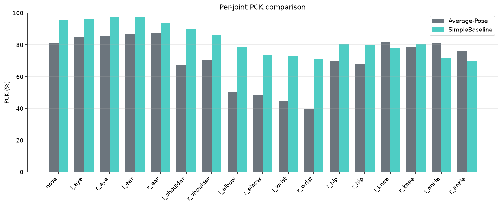
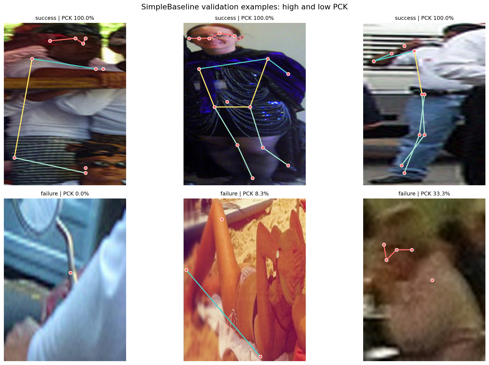
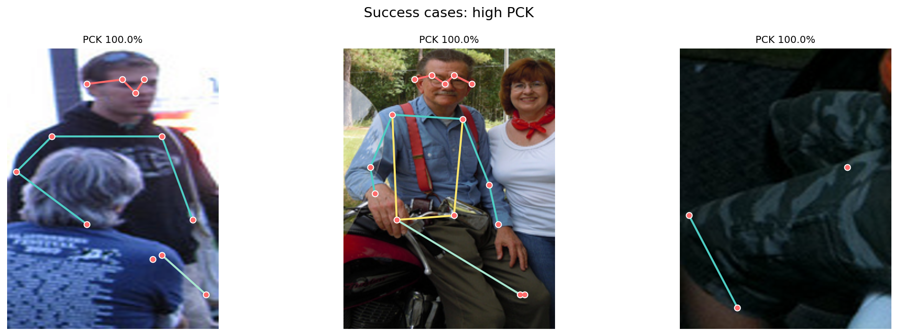
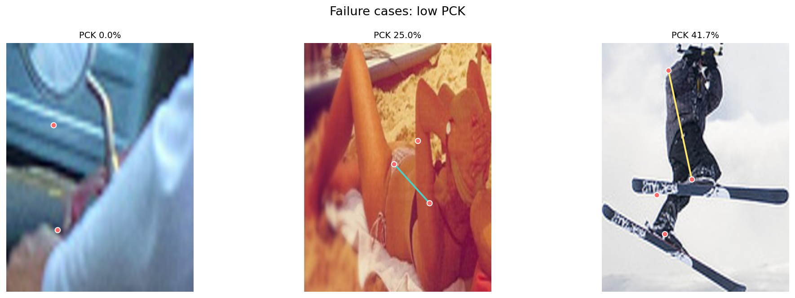

# Project 7: Human Pose Estimation
## 192.151 Introduction to Deep Learning TU Wien, 2026S

**Authors:** Jane Wangari · Lukas Haindl · Yannick Tuerk

---

## Overview

This project implements and evaluates three 2D human pose estimation systems on the COCO val2017 dataset:

| Model | Mean PCK | Val Loss | Parameters |
|---|---|---|---|
| Trivial average-pose baseline | 69.5% | — | 0 (no training) |
| Baseline (ResNet-50 + heatmap head) | 82.9% | 0.00185 | ~25M |
| SimpleBaseline (ResNet-50 + deconv head) | 83.4% | 0.00178 | ~34M |

All models predict 17 COCO body keypoints (nose, eyes, ears, shoulders, elbows, wrists, hips, knees, ankles) as Gaussian heatmaps, trained with MSE loss and evaluated with PCK (Percentage of Correct Keypoints, threshold = 20% of bounding box diagonal).

### Key findings

1. **Training strategy matters more than architecture.** Naive joint training of the backbone and head produced only 16.6% PCK. A freeze-then-finetune strategy, freezing the backbone for 5 epochs before joint fine tuning with differential learning rates, recovered this to 82.9%. A 66pp improvement from one training decision, larger than any architectural difference.

2. **The trivial baseline reveals joint level pose variance.** A fixed average pose template scores 87% on ears but collapses to 39% on wrists, exposing which joints require genuine image understanding versus structural body priors.

3. **SimpleBaseline's advantage is targeted.** Gains are concentrated on high variance joints (elbows +2.6–5.3pp, wrists), consistent with the architectural reasoning of Xiao et al. (2018).

---

## Repository Structure

```
├── configs/
│   └── coco_simplebaseline.yaml     # Training and evaluation config
├── notebooks/
│   └── PoseEstimation_Baseline.ipynb  # Original exploratory notebook
├── outputs/                          # Generated by scripts (gitignored)
│   ├── simplebaseline_weights.pth
│   ├── figures/
│   └── results/
├── report/
│   └── figures/                      # Committed result figures
│       ├── training_loss_curve.png
│       ├── per_joint_pck.png
│       ├── pck_comparison.png
│       ├── prediction_examples.png
│       ├── success_cases.png
│       ├── failure_cases.png
│       └── target_heatmap_example.png
├── scripts/
│   ├── train.py                      # Main training script
│   ├── evaluate_pck.py               # PCK evaluation
│   ├── evaluate_trivial_baseline.py  # Trivial baseline evaluation
│   ├── compare_baselines.py          # Side-by-side comparison
│   ├── visualize_predictions.py      # Prediction visualizations
│   ├── make_report_figures.py        # Generates all report figures
│   └── check_pck_sanity.py          # Synthetic PCK sanity check
├── src/
│   ├── data/                         # Dataset and dataloader
│   ├── models/                       # Baseline and SimpleBaseline models
│   ├── training/                     # Training loop and strategy
│   └── evaluation/                   # PCK and COCO AP metrics
├── .gitignore
├── README.md
└── requirements.txt
```

---

## Installation

```bash
git clone https://github.com/janewangari-sudo/intro-to-dl-pose-estimation.git
cd intro-to-dl-pose-estimation
pip install -r requirements.txt
```

COCO val2017 images and annotations are downloaded automatically on the first training run into `coco/`.

---

## Reproducing Results

All commands are run from the repository root.

### 1. Train SimpleBaseline

```bash
python scripts/train.py --config configs/coco_simplebaseline.yaml
```

Saves weights, loss history, and loss curve to `outputs/`. Default settings: 256×192 input, 64×48 heatmaps, MSE loss, 30 epochs, backbone frozen for epochs 1–5 then unfrozen with lr=1e-4.

### 2. Evaluate PCK

```bash
# SimpleBaseline
python scripts/evaluate_pck.py --config configs/coco_simplebaseline.yaml

# Trivial average-pose baseline
python scripts/evaluate_trivial_baseline.py --config configs/coco_simplebaseline.yaml
```

### 3. Compare models

```bash
python scripts/compare_baselines.py --config configs/coco_simplebaseline.yaml
```

Writes `outputs/figures/pck_comparison.png` and `outputs/figures/per_joint_pck.png`.

### 4. Visualize predictions

```bash
python scripts/visualize_predictions.py --config configs/coco_simplebaseline.yaml
```

Selects high- and low-PCK validation examples and writes `outputs/figures/prediction_examples.png`.

### 5. Generate all report figures

```bash
python scripts/make_report_figures.py
```

### 6. COCO AP evaluation (optional)

```bash
python scripts/evaluate_coco_ap.py --config configs/coco_simplebaseline.yaml
```

---

## Training Strategy — Ablation

| Strategy | Mean PCK | Outcome |
|---|---|---|
| Naive joint training (lr=1e-3) | 16.6% | Collapses after epoch 1 |
| Freeze backbone 5 epochs, then finetune | 82.9% | Stable convergence |

**Why naive training fails:** the randomly-initialised head produces large gradient noise that corrupts the pretrained backbone weights in the first update. Freezing the backbone allows the head to stabilise before any backbone adjustment occurs.

---

## Results

### Per joint PCK



### Predictions



### Success and failure cases




---

## Dataset

- **COCO val2017** — ~5,000 images with 17-joint person annotations
- Filtered to ≥5 visible keypoints per person
- 85/15 train/val split → ~3,987 train / 703 val samples
- Input: 256×192 per-person crops, normalised with ImageNet mean/std
- Targets: 64×48 Gaussian heatmaps (σ=2)

> **Note:** Due to free tier Colab compute constraints, we trained on COCO val2017 rather than the full train2017 set (118,000 images). This limits absolute performance compared to published benchmarks but does not affect relative comparisons between models.

---

## References

1. Xiao, B., Wu, H., & Wei, Y. (2018). *Simple Baselines for Human Pose Estimation and Tracking*. ECCV. https://arxiv.org/abs/1804.06208
2. He, K., Zhang, X., Ren, S., & Sun, J. (2016). *Deep Residual Learning for Image Recognition*. CVPR. https://arxiv.org/abs/1512.03385
3. Lin, T.-Y., et al. (2014). *Microsoft COCO: Common Objects in Context*. ECCV. https://arxiv.org/abs/1405.0312
